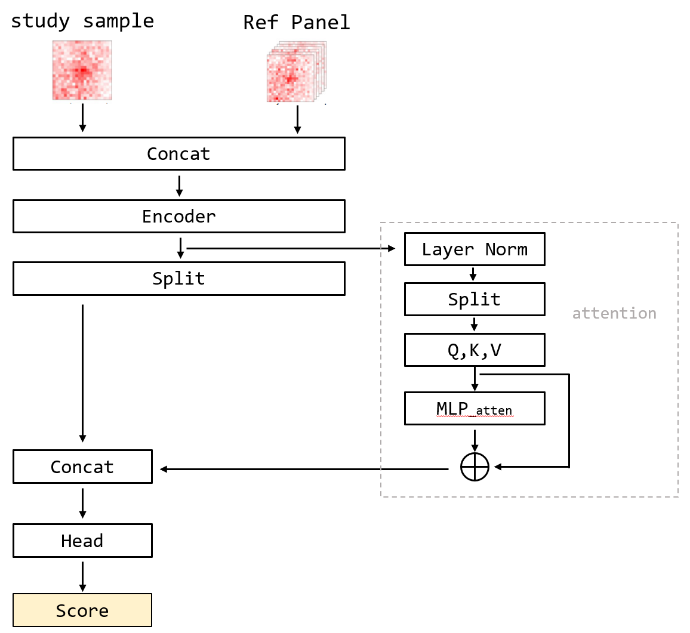
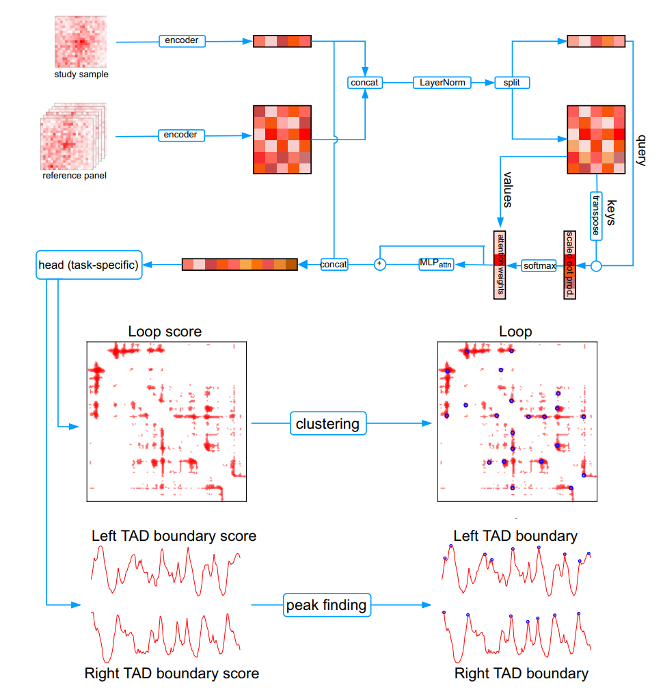
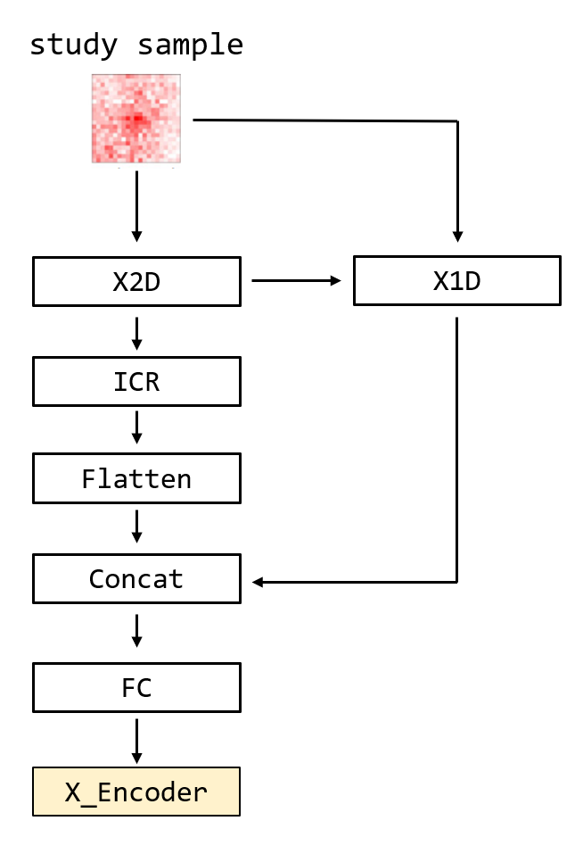

# Reference panel guided topological structure annotation of Hi-C data

参考面板引导 Hi-C 数据的拓扑结构标注

## 1. 专有名词术语

1. `Hi-C`：Hi-C的全称是"High-throughput Chromosome Conformation Capture"，翻译为“高通量染色体构象捕获”。这一技术被设计用于捕获和研究细胞核内染色质的三维结构，通过测定基因组中不同区域之间的空间关系，有助于理解基因组的空间组织和其对细胞功能的影响。
2. `Contact map`：接触图
3. `topological associating domains, TAD`：拓扑关联域

## 2. GPT总结

### 2.1 ChatPaper

#### 2.1.1 摘要

为了从给定的Hi-C数据中标注拓扑结构，论文提出了一种基于参考面板的深度学习框架RefHiC。通过比较不同细胞类型、物种和测序深度，发现RefHiC在TAD和loop标注方面优于其他工具。

#### 2.1.2 背景信息

- 论文背景：准确标注Hi-C数据中的拓扑结构，对于理解3D基因组组织在基因调控中的作用至关重要，然而在高分辨率下，由于HiC数据的测序覆盖度有限，这是一项具有挑战性的任务。
- 之前方案：主要集中在分析感兴趣的单个Hi-C数据集，而没有充分利用公开可用的数百个Hi-C接触图，以及大多数拓扑结构在多个细胞类型中的保守性。现有的TAD标注工具在低覆盖度下的性能较差，而环检测更具有挑战性，理由是其在接触图中的尺寸较小。
- 论文Motivation：鉴于现有方法的局限性，本论文利用参考面板和深度学习框架来提高HiC数据中拓扑结构的标注准确性和鲁棒性。通过引入参考样本，RefHiC能够利用多个细胞类型的数据来辅助标注给定研究样本中的拓扑结构，从而提高标注的准确性和可靠性。

#### 2.1.3 方法

RefHiC模型。

### 2.2 GPT-4

文章中介绍的 RefHiC 是一个深度学习框架，旨在注释 Hi-C 数据中的拓扑结构，例如 DNA环 和 TAD。 该模型的架构集成了注意力机制，并利用了各种 Hi-C 数据集的参考面板。 这种方法使模型能够辨别不同参考样本与研究样本的相关性，从而提高预测准确性。

RefHiC 的主要优势包括：

高精度：尤其是在高分辨率和低测序深度条件下检测染色质环和 TAD 时。
跨细胞类型和物种的稳健性：展示出对不同生物环境的多功能性和适应性。
不同条件下的效率：得益于其参考面板方法，即使测序数据有限，也能表现良好。

算法实现涉及：

编码器和注意力模块：用于处理和集成来自研究和参考样本的信息。
特定于任务的组件：用于从高分簇中识别循环和 TAD 边界。
RefHiC 因其能够准确注释 Hi-C 数据中的拓扑结构而脱颖而出，与现有方法相比显示出显着改进，特别是在低覆盖率场景中。 该模型对各种细胞类型和物种的适应性进一步强调了其在不同基因组研究中的实用性。

## 3. 摘要

从 `Hi-C` 数据中准确注释拓扑结构（例如环`loop`和拓扑关联域(`topological associating domains, TAD`)）对于理解 3D 基因组组织在基因调控中的作用至关重要。

这是一项具有挑战性的任务，尤其是在高分辨率下，部分原因是 Hi-C 数据的测序覆盖范围有限。

目前的方法侧重于分析感兴趣的单个Hi-C数据集，而没有利用以下事实：（i）几百个Hi-C接触图是公开可用的，以及（ii）绝大多数拓扑结构在多种细胞类型中是保守的。

在这里，我们提出了 `RefHiC`，一个基于注意力的深度学习框架，它使用 Hi-C 数据集的参考面板来促进给定研究样本的拓扑结构注释

我们将 `RefHiC` 与不使用参考样本的工具进行比较，发现 RefHiC 在跨不同细胞类型、物种和测序深度的拓扑关联域TAD和环注释方面均优于其他方法。

## 4. RefHiC 模型

### 4.1 整体框架

根据代码实现绘制的框架图

论文中的框架图

### 4.2 Encoder 模块

## 5. 评价

模型设计的原则是利用 ref panel 信息指导神经网络学习到 study sample 中的隐含信息，并输出 loop score 和 TAD boundary score.

**关键词: 多模态融合; 注意力机制; 多任务学习**

### 5.1 优点

1. 沿用了 `split-transform-merge` 设计范式，提升模型了表达能力。
2. 借助 `self-attention` 模块，很好地利用了参考信息。
3. 比现有工具使用的模型复杂
   - `Peakachu`: 简单的二分类器
   - `HiCCUPS`: 数学公式与物理仿真
   - `Mustache`: scale-space 理论
   - `Chromosight`: 核卷积方法

### 5.2 不足

1. 共用 `encoder` 模块的问题。`study sample` 和 `ref panel` 共用一个encoder模块，会导致该模块参数相同，对二者的特征提取可能不足。
2. 模态融合的问题。简单的 `concat` 模块对于二者的融合能力是不足的。由于 `ref panel` 是**专家信息/先验知识**，因此神经网络的设计应当遵循 [`wide & deep` 原则](https://www.zhihu.com/question/529959915/answer/2470689232)。即 **重要特征加得浅** 以及 **重要特征当裁判**。这方面可以有两点改进。
   - 尽可能增加特征提取网络也就是 `Encoder` 的复杂度
   - 尽可能减少对于 `ref panel` 的信息破坏程度。由于 `ref panel` 是图片，因此还是需要一些特征提取层，但应该在确保提取到有效特征后就减少不必要的网络层数。
   - 使用注意力机制将 **专家信息编码进网络的决策中**。这一步可以使用各种各样的注意力机制。比如 `SE-Net`，`SKNet` 中的 `split-attention`，以及`transformer`中的`self-attention` 机制等。
3. 多任务的问题。`RefHiC` 在同一时间内只能输出一类的 `score`。若输出个数不多的话，可以考虑为每个输出设计一个相同的分支。举个例子，可以在第二次 `concat` 后设计一个 `bottle-neck`层，里面包括一些特征提取模块，然后可以为每个分支设计相同的 `head`，每个 `head` 的输出 `shape` 为 `(Batchsize, 1)`。这种做法的原则来源于**多任务学习**。所设计的 `bottle-neck` 层的作用是 **参数共享， 偏置归纳**，使得不同的任务在该共享空间内互相制约，引入对方的噪声，从而学习到更鲁棒的表示。基于多任务学习的任务范式，这也是为什么共用 `encoder` 可能会导致意料之外的问题的原因。
4. 消融实验的问题。`baseline-net`直接取消了 `ref-panel` 的输入，个人觉得不够严谨。若要对比加入 `ref panel` 前后的效果，`RefHiC` 中不应该设置注意力结构。设置了注意力机制后，不太容易判断模型效果的提升是来源于 `ref panel` 的加入还是 注意力机制的设计。
